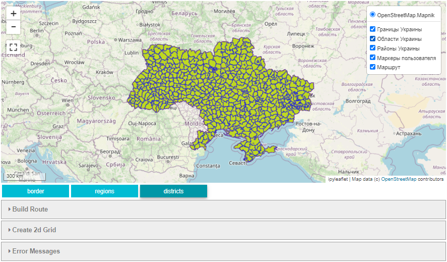
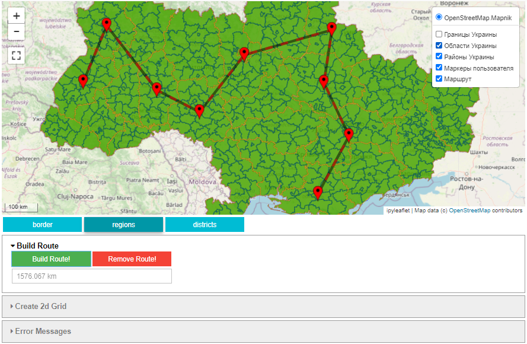
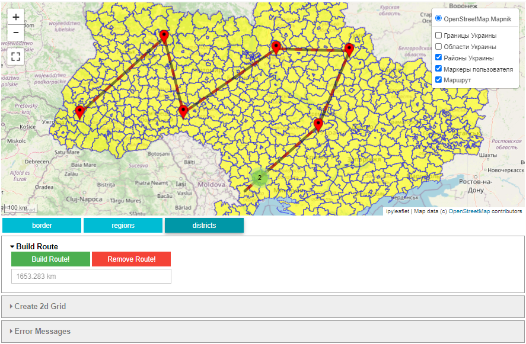
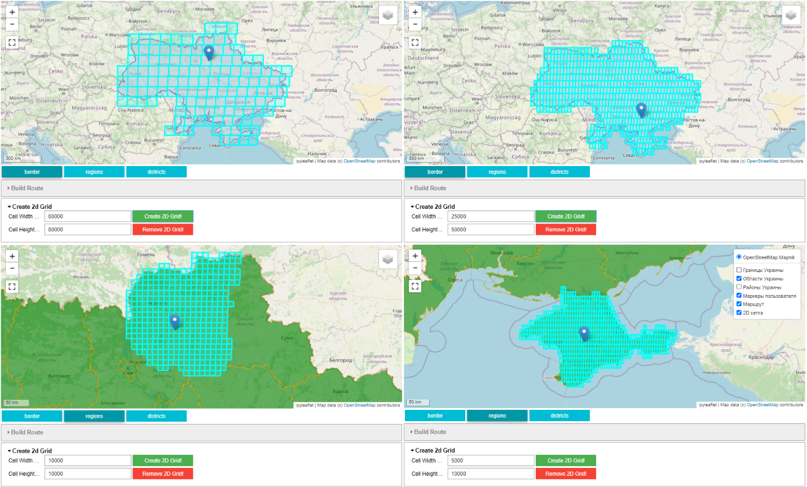
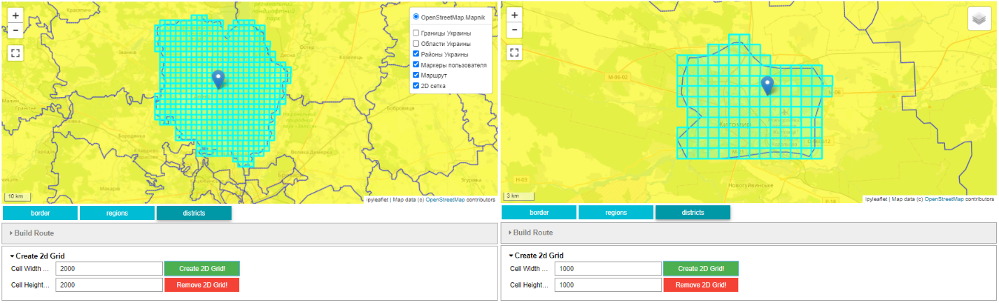

# Geographic information system (country)

**Geographic information system that interactively implements the functions of analyzing geographic data:**

- Finding the centers of geographic features (regions, districts);
- Building the shortest route between two regions/districts;
- Building the shortest route through an arbitrary number of regions/districts;
- Creating a 2D grid that covers the specified polygons (border, regions or districts) with cells of a given size.

---

**What was used?**

- Python 3.10.6;
- PostgreSQL 14;
- [PostGIS](https://postgis.net/) extension for PostgreSQL;
- Jupyter Notebook;
- [ipyleaflet](<https://ipyleaflet.readthedocs.io/en/master/>) for interactive map in Jupyter Notebook;
- QGIS (open source geographic information system).

---

**What was done?**

- Created a new PostgreSQL user and a new database;
- Enabled the `PostGIS` extension for the database;
- Imported shapefiles into the newly created database using QGIS;
- Created a stored procedure and a table to get and store regions and districts centers, respectively;
- Created a stored function to build the shortest route between two regions/districts that are specified by the user as two arbitrary points;
- Created a stored procedure to build the shortest route through an arbitrary number of regions/districts that are specified by the user;
- Created a stored procedure to build the 2D grid that covers the specified polygons (border, regions or districts) with cells of a given size;
- Implemented an interactive map with several layers:
  - layers with data on border, regions ans districts of Ukraine;
  - user marker layer;
  - route layer;
  - 2D grid layer.
- Implemented the calculation of the length of the received route.

---

**Examples**

**Figure 1** - Initial view of the interactive map


**Figure 2** - Route building (layer "Regions of Ukraine")


**Figure 3** - Route building (layer "Districts of Ukraine")


**Figure 4** - Creation of a 2D grid ("Border", "Regions of Ukraine" layers)


**Figure 5** - Creation of a 2D grid (layer "Districts of Ukraine")

---

**How to run on your PC**

1. Create new virtual environment, for example:

    ``` bash sh shell zsh
      python -m venv venv
    ```

2. Clone this repository:

    ``` bash sh shell zsh
    git clone https://github.com/mamchurovskyy/gis-country.git
    ```

3. Active virtual environment and install all required libraries using `requirements.txt` file:

    ``` bash sh shell zsh
    pip install -r requirements.txt
    ```

4. Enable notebook extension:

    ``` bash sh shell zsh
    jupyter nbextension enable --py --sys-prefix ipyleaflet
    ```

5. Create new PostgreSQL database using `.backup` file;

6. Create `.env` file and add there `DB_NAME`, `DB_USER` and `DB_PASSWORD`;

7. Start Jupyter Notebook:

    ``` bash sh shell zsh
    jupyter notebook
    ```

8. Run all cells and have fun =)
